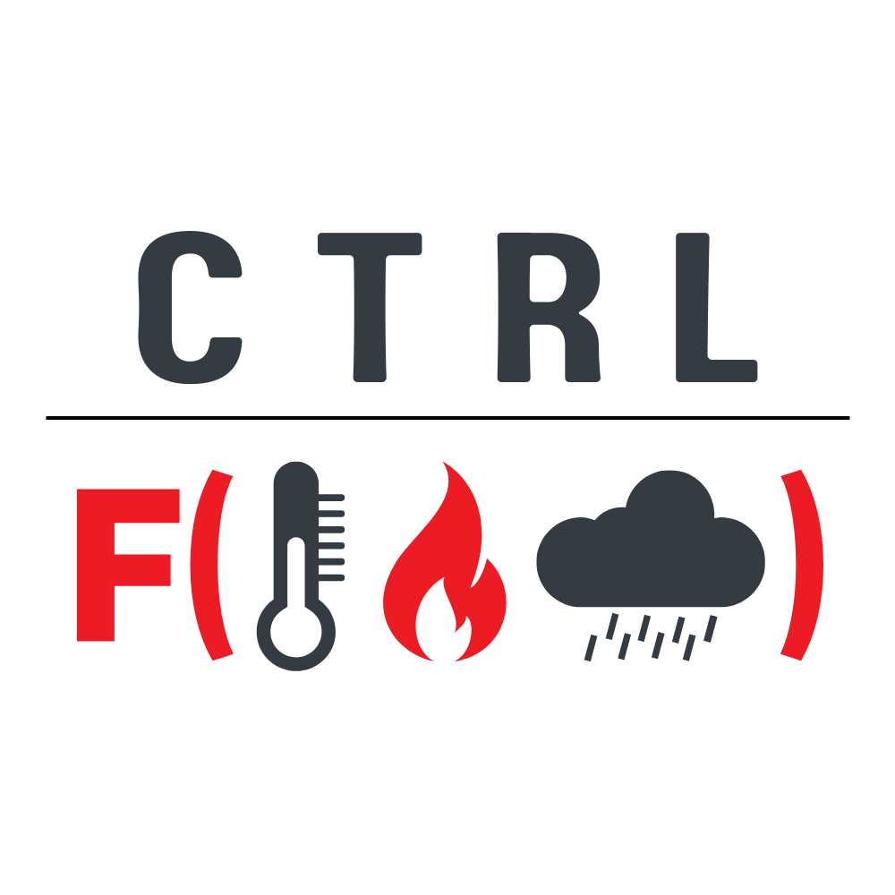

# Ctrl-F

'.cdsapirc' file must be stored in the home folder of your local machine to build the connection with the online "Copernicus Data Store (CDS)". This holds your URI and the API key to download the data using an API into your local machine using python. You must have a registered account with CDS and for further information visit [How to use the CDS API](https://cds.climate.copernicus.eu/api-how-to)

